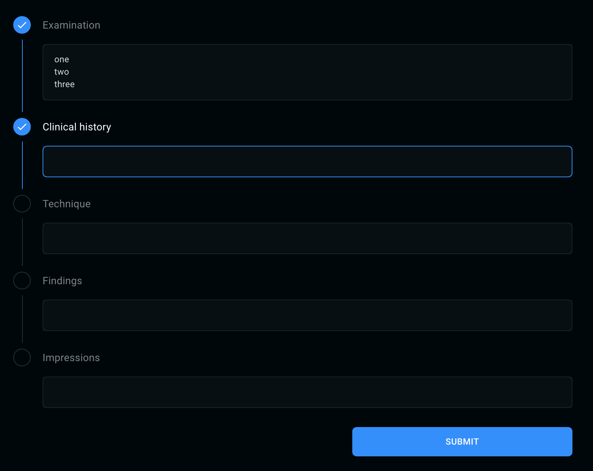

This multi-step test is designed to test your ability to adapt your code to new requirements.
Once you complete a step, a new one will be added, until the test is completed.

Keep your code lean, and try to think about solutions that can help you reduce the amount of logic needed to fulfill the requirements.

1. Create a list of text-areas, with related labels, one for each of the following sections:

   - Examination
   - Clinical History
   - Technique
   - Findings
   - Impressions

   Add a "Submit" button at the bottom of the page, on click it will `console.log` the text of each of the above fields (`{ examination: 'text', clinicalHistory: 'text', etc... }`);

2. Add a little gray-outlined dot near each text-area's label:

   - When a text-area is focused, its label will become white (on blur, go back to gray);
   - When a text-area is focused, its nearby dot will have white outline;
   - When the user proceeds to a different text-area, fill the dot blue and show a check symbol (✓) inside it;

   Look at  to get a clearer idea of the expected result

3. If the user enters a new line in any of the text-areas, the text-area will grow to make all the lines visible. If the user removes a line, the text-area will shrink with it to fit its content;

4. (BONUS POINT) When the "Submit" button is pressed, a little toast notification should appear on the upper-right corner of the page:

   - The text should read _"Your report has been successfully submitted"_;
   - The notification should fade away after 3 seconds;
